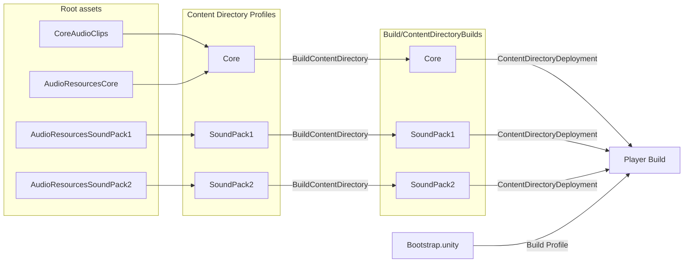
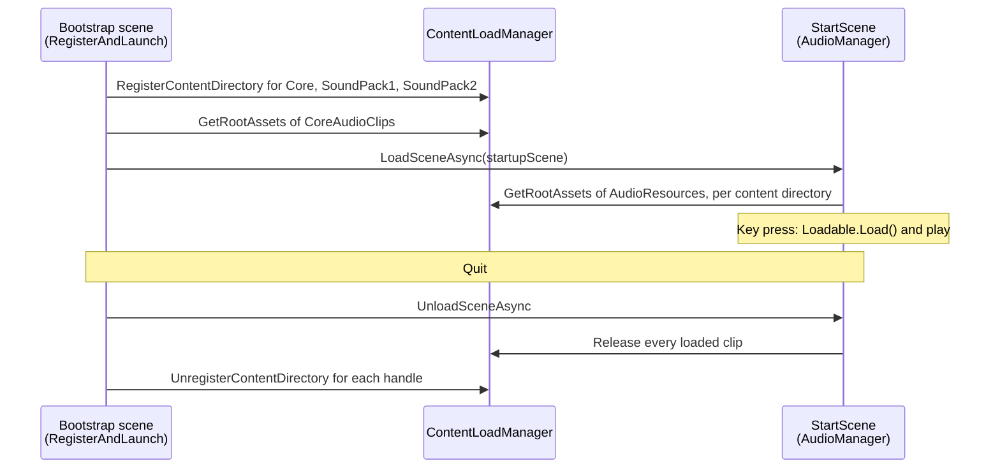

# Content Directory Audio Example

An example of splitting audio content across several content directories, using the
[content directory](https://docs.unity3d.com/Manual/content-directories.html) API released in Unity 6.6.
It requires Unity 6000.6.3f1 or a later Unity 6.6 release.

It uses a "Core" content directory that simulates the non-DLC content that would always ship with the
player.  Additional audio clips are then built into separate content directories (aka "Sound Packs").
Root assets — ScriptableObjects nominated as the entry points of a build — organize this content for
both building and loading.

## Usage

This project can be tested in Editor play mode or built to a player (using the Build Profile window).
When testing in Editor play mode, open `Bootstrap.unity`.

Two sounds play automatically when the example starts.  After that the keyboard drives everything:

| Key       | Action                                                     |
| --------- | ---------------------------------------------------------- |
| `1` - `9` | Play a clip from the Core content directory                |
| `A` - `E` | Play a clip from SoundPack1                                |
| `F` - `J` | Play a clip from SoundPack2                                |
| `Del`     | Stop playback                                              |
| `F1`      | Show / hide the on-screen key list                         |
| `Esc`     | Quit (in the Editor, exit play mode)                       |

Each clip is named after the key that plays it, so `a.mp3` plays when you press the `A` key.  The keys
that do anything therefore depend on which content directories have been built and registered — `F1`
lists the ones that are currently available, grouped by the content directory that provided them.

### Building the Core and Sound Packs

Select the "Content Directory Profile" assets in the `Assets/Editor/ContentBuilds` folder and click
"Build Content Directory" in the Inspector to start each build.

You must build the "Core" content directory before the project will run at all, because the startup
scene lives inside it.  The Sound Packs are optional; build them and the `A` - `J` keys start working.

Content directory builds are written to `Build/ContentDirectoryBuilds`, which keeps generated content
out of the `Assets` folder and out of source control.  A `BuildPlayerProcessor` copies them into
StreamingAssets during the player build.

There is also a custom build script with menu options under "Example".  These exist mainly for CLI
builds, which are convenient for agentic access to the project.  Working directly in the Editor needs
no custom build script.

### Changing the platform

Content directory and player builds both use the active platform, as selected in the Build Profile
window.  The profile assets do not pin a platform, so switching the active platform and rebuilding is
all that is required.

## How the Pieces Fit Together

At build time, root assets decide what goes into each content directory, and the player build picks up
whatever content directories have been built:

`StartScene.unity` and the audio clips end up in the Core and Sound Pack
builds because the root assets reference them.

At runtime, the bootstrap scene registers the content directories and then hands over to the startup
scene, which reads its clips from whatever is registered.  Shutdown runs in the reverse order:

## Overview of Project Content

`Bootstrap.unity` is the only scene built into the player.  It hosts `RegisterAndLaunch`, which
registers the Content Directories and loads the startup scene out of the Core directory.

`StartScene.unity` lives inside the Core content directory and hosts the audio components and the
on-screen key list.

Example audio clips are in the `Assets/Samples` folder, with one folder per content directory that
consumes them:

* `Core`, `SoundPack1` and `SoundPack2` hold the clips named after keyboard keys.
* `Startup` holds `clip01` and `clip02`.  These are reached through named fields on `CoreAudioClips`
  rather than by key, so they are the one case where the clip name is not a keyboard key.
* `Extra` holds spare clips `k` to `p`.  Nothing references them; they are there for the "add another
  Sound Pack" exercise below.

The `RootAssets` folder contains the ScriptableObjects that reference those clips:

* `CoreAudioClips.asset` references clips through named fields, one per intended use, such as
  `startupSound`.  A single asset of this type is expected.
* `AudioResourcesCore.asset` is a more general table of clips, each tracked by name.
* `AudioResourcesSoundPack1.asset` and `AudioResourcesSoundPack2.asset` use the same ScriptableObject
  type and reference the clips for each Sound Pack.

Each `AudioResources` asset names one folder under `Assets/Samples` and keeps its table filled from the
audio clips in it, so the table never has to be maintained by hand.  Use the "Track a Directory of Audio
Clips" button in the Inspector to choose the folder; after that, adding, removing, renaming or moving a
clip in the folder updates the asset on its own.

The `Editor` folder contains content excluded from the player build:

* `ContentBuilds` holds the content directory Profile assets, one per content directory, each
  referencing the root assets to include and the output path to write.  The Sound Pack profiles set
  the `UseArchive` option, so each pack is written as a single `.archive` file, while Core is left as
  loose files to show both layouts.
* `ContentDirectoryProfile.cs` and `ContentDirectoryProfileEditor.cs` define the profile
  ScriptableObject itself, and the Inspector that edits it and launches its build.
* `AudioResourcesEditor.cs` adds the "Track a Directory of Audio Clips" button to the `AudioResources`
  Inspector.
* `AudioResourcesWatcher.cs` is an `AssetPostprocessor` that refills an `AudioResources` asset whenever
  the folder it tracks changes.
* `ContentDirectoryDeployment.cs` copies the built content directories into the player build, writes
  the listing file the player reads, and preloads the files for a Web build.
* `BuildAll.cs` provides the "Example" menu items used for CLI builds.

The `Scripts` folder contains the MonoBehaviours and ScriptableObjects:

* `RegisterAndLaunch.cs` runs from the bootstrap scene and owns the content directories for the whole
  session: it registers them, loads the startup scene, and unregisters them on shutdown.
* `CoreAudioClips.cs` is a root asset that assigns specific sounds to specific moments.
* `PlayFromCoreAudioClips.cs` plays the startup sounds through the `CoreAudioClips` named fields.
* `AudioResources.cs` is a root asset holding a general library of clips that can be played by name.
  One or more can be built into any content directory.  The folder it tracks is an Editor only field,
  since a player needs the clips but not the folder they were gathered from.
* `AudioManager.cs` assembles the clips from every registered content directory into one list of
  key bindings, and plays them on the matching key press.
* `ContentDirectoryManager.cs` finds and registers content directories, and unregisters them again.
* `AudioKeyLegend.cs` draws the on-screen key list.

## Concepts demonstrated in this Example

* Use of the regular player build UI, with minimal content in the player itself.
* Use of content directories to build content that is not part of the player build.
* Use of content directory Profile assets to define content-only builds, without a custom build script.
* Use of `Loadable<T>` to reference content for a build.  A `Loadable<AudioClip>` field, rather than a
  plain `AudioClip` field, defers loading the audio until it is needed instead of pulling every sample
  in at startup.
* Use of `LoadableSceneId` to reference a scene that lives in a content directory, and load it by id.
* Use of `ContentLoadManager.GetRootAssets<T>()` to find content, working the same way in the player
  and in Editor play mode.
* Use of a serialized `Dictionary` field, so `AudioResources` maps clip names to clips with no custom
  serialization or Inspector code.
* Use of an `AssetPostprocessor` to keep a root asset in step with a folder of assets, so a list of
  content is maintained by the Editor rather than by hand or by a pre-build step.
* Use of `BuildPlayerProcessor.PrepareForBuild()` and
  `BuildPlayerContext.AddAdditionalPathToStreamingAssets()` to pull content directory builds into the
  player, without the cost of putting built content in `Assets/StreamingAssets`.
* Discovery of content directories based on build folder convention, so that new Sound Packs can be added
  without changing code.
* Releasing `Loadable` content when the MonoBehaviour that loaded it is destroyed.
* Ordered shutdown: the startup scene is unloaded before its content directory is unregistered, since
  a directory cannot be torn down while content loaded from it is still in use.

## Tutorial Recommendations

The following are some suggested exercises that could be implemented to extend the project, and learn
more about the Unity 6.6 build and load system:

* Follow the instructions above and build for several platforms.
* Add a key to the `AudioManager` that plays all available clips in sequence, with a short delay
  between each.
* Extend the `AudioManager` to print additional statistics, for example the size of the clips that are
  currently loaded.
* Add another Sound Pack using the clips in `Assets/Samples/Extra`.  This should not require changing
  any code — the clips are already named `k`, `l`, `m` and so on, so they can be played from the
  keyboard.  Adding clips to a folder that an existing `AudioResources` asset already tracks requires
  no Editor work at all.
* Split the Core content directory in two, and confirm the key list still reports each clip against
  the directory that provided it.
* Add a keyboard option to reload the Sound Pack content directories at runtime.  Add or remove
  SoundPack directories in the player's StreamingAssets folder to test this.  Note: this exercise is
  not suitable for platforms where the StreamingAssets folder is read-only, or is located inside a
  container file (`.apk`, `.jar`, `.data`, and so on).
* Port the example to use content directories through Addressables.
* Adjust the code to find Sound Packs in other locations on the local file system.
* Add code to discover and download soundpacks from a web server to a local file system location, then
  load them in the player.  Although Unity does not have full support for remote distribution of content
  directories in Unity 6.6, the simple structure of this project lends itself to a "write your own" solution.

## Additional Resources

* [Use content directories to load assets at runtime](https://docs.unity3d.com/Manual/content-directories.html)
* [Create content directories](https://docs.unity3d.com/Manual/content-directories-create.html)
* [Reference content in a content directory](https://docs.unity3d.com/Manual/content-directories-references.html)
* [Include scenes in a content build](https://docs.unity3d.com/Manual/content-directories-scenes.html)
* [Load content directories](https://docs.unity3d.com/Manual/content-directories-load.html)
