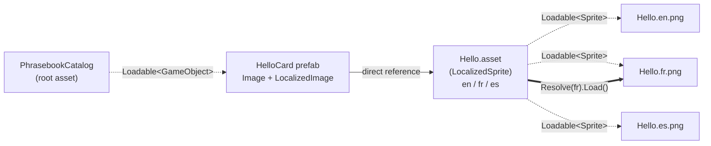

# Phrasebook Example

Localized images in a single [content directory](https://docs.unity3d.com/Manual/content-directories.html),
built with Unity 6.6.

The scene shows four greeting cards. A dropdown selects English, French or Spanish, and every card
swaps to the image for that language. All twelve images are built into one content directory, and the
player loads only the ones for the selected language.

This is the content directory way to ship the same content in several variants and pick one at
runtime, a job that AssetBundle variants used to do. There is no build-time or file-name magic
involved: the variants are ordinary data on a `ScriptableObject`, referenced through `Loadable<T>`.

| English | French | Spanish |
|---|---|---|
|  |  |  |

## Usage

Open `Assets/Scenes/Phrasebook.unity` and press Play. Pick a language from the dropdown.

To build a player, select **Example > Build Player**. The player is built for the active platform into
`Build/Player`, and the content directory is built and copied into its `StreamingAssets` folder as
part of that build. Run the player and use the dropdown in the same way.

The line at the bottom of the screen shows the name of the sprite each card is showing, for example
`Hello.fr`, so you can see which variant is loaded.

## How the pieces fit together

* **`LocalizedSprite`** is a `ScriptableObject` with a dictionary from language code to
  `Loadable<Sprite>`. One asset exists per phrase. Because the entries are loadable references, the
  build includes every language's sprite, but loading the asset loads none of them.
* **`LocalizedImage`** sits next to an `Image` on each card prefab and holds a direct reference to the
  phrase's `LocalizedSprite`. When it is enabled, and whenever the language changes, it resolves the
  entry for the current language, loads that one sprite, shows it, and releases the previous one.
* **`PhrasebookCatalog`** is the root asset passed to `BuildContentDirectory`. It lists the card prefabs
  as `Loadable<GameObject>`. The build follows the references from there, so the whole phrasebook is
  built from this one asset.

Dotted lines are on-demand references and solid lines are direct references. A direct reference loads
with the object that holds it, which is fine for the small `LocalizedSprite` asset. A loadable
reference is built but only loaded when code asks for it, which is what keeps the other languages out
of memory.

## Play mode and the player

The example does not need a content build to run in the Editor. In Play mode, `CatalogProvider` loads
`PhrasebookCatalog.asset` from the project, and the `Loadable` fields reached from it resolve to the
project's assets. In a player it registers the content directory from `StreamingAssets` and reads the
catalog from there with `ContentLoadManager.GetRootAssets`. Nothing else in the code knows the
difference.

The [AudioExample](../AudioExample/) shows the other approach, where Play mode registers a content
directory that was built beforehand, so that the Editor and the player exercise the same code path.

## Project content

* `Assets/Cards/<Phrase>/` holds the images for one phrase, named `<Phrase>.<lang>.png`, and the
  phrase's `LocalizedSprite` asset, `<Phrase>.asset`. The language is a lower-case two-letter code.
* `Assets/Prefabs/` holds one card prefab per phrase: an `Image` with a `LocalizedImage`.
* `Assets/RootAssets/PhrasebookCatalog.asset` is the root asset of the content build.
* `Assets/Scenes/Phrasebook.unity` is the only scene in the player. It holds the UI and the
  `PhrasebookController`.
* `Assets/Scripts/`
  * `LanguageSetting.cs`: the current language, the list of languages, and a change event.
  * `LocalizedSprite.cs`, `LocalizedImage.cs`, `PhrasebookCatalog.cs`: the three types described above.
  * `CatalogProvider.cs`: returns the catalog, from the project in Play mode or from the content
    directory in a player.
  * `PhrasebookController.cs`: fills the dropdown, instantiates the cards, and writes the status line.
* `Assets/Editor/`
  * `LocalizedSpriteSync.cs`: an `AssetPostprocessor` that fills each `LocalizedSprite` from the images
    in its folder whenever they change, and warns when a language is missing. **Example > Sync
    Localized Sprites** runs it over every folder.
  * `CardTextureImporter.cs`: imports the card images as sprites.
  * `BuildAll.cs`: the **Example** menu items.
  * `ContentDirectoryDeployment.cs`: a `BuildPlayerProcessor` that builds the content directory during
    the player build and adds it to `StreamingAssets`.
* `Tools/New-PhraseCards.ps1` generated the card images. It is only needed to change a word or add a
  language; the images are committed.

## Adding a phrase or a language

To add a phrase, create `Assets/Cards/<Phrase>/` with a `<Phrase>.<lang>.png` for each language.
The sync creates `<Phrase>.asset`. Then make a card prefab for it and add the prefab to
`PhrasebookCatalog`.

To add a language, add its code and name to `LanguageSetting.Available` and add a
`<Phrase>.<lang>.png` to every phrase folder. Until every folder has the image, the Console warns
which phrase is missing it, and that card falls back to English.

## Concepts demonstrated

* `Loadable<T>` values inside a serialized `Dictionary`, so one asset describes every variant of a
  piece of content.
* A prefab that references a small `ScriptableObject` instead of a sprite, so the prefab is not tied to
  one language and loading it does not load any image.
* Resolving a variant at runtime and releasing the previous one, with the choice kept in one place.
* A single root asset that pulls the whole phrasebook into the content directory build through
  references, with no list of files to maintain.
* An `AssetPostprocessor` that keeps the data assets in step with a folder of images and reports gaps.
* `BuildPlayerProcessor.PrepareForBuild` building the content directory for the active platform inside
  the player build, and `AddAdditionalPathToStreamingAssets` shipping it with the player.
* Running in Play mode from the project's assets, with no content build required.

## Additional resources

* [Use content directories to load assets at runtime](https://docs.unity3d.com/Manual/content-directories.html)
* [Create content directories](https://docs.unity3d.com/Manual/content-directories-create.html)
* [Reference content in a content directory](https://docs.unity3d.com/Manual/content-directories-references.html)
* [Load content directories](https://docs.unity3d.com/Manual/content-directories-load.html)
